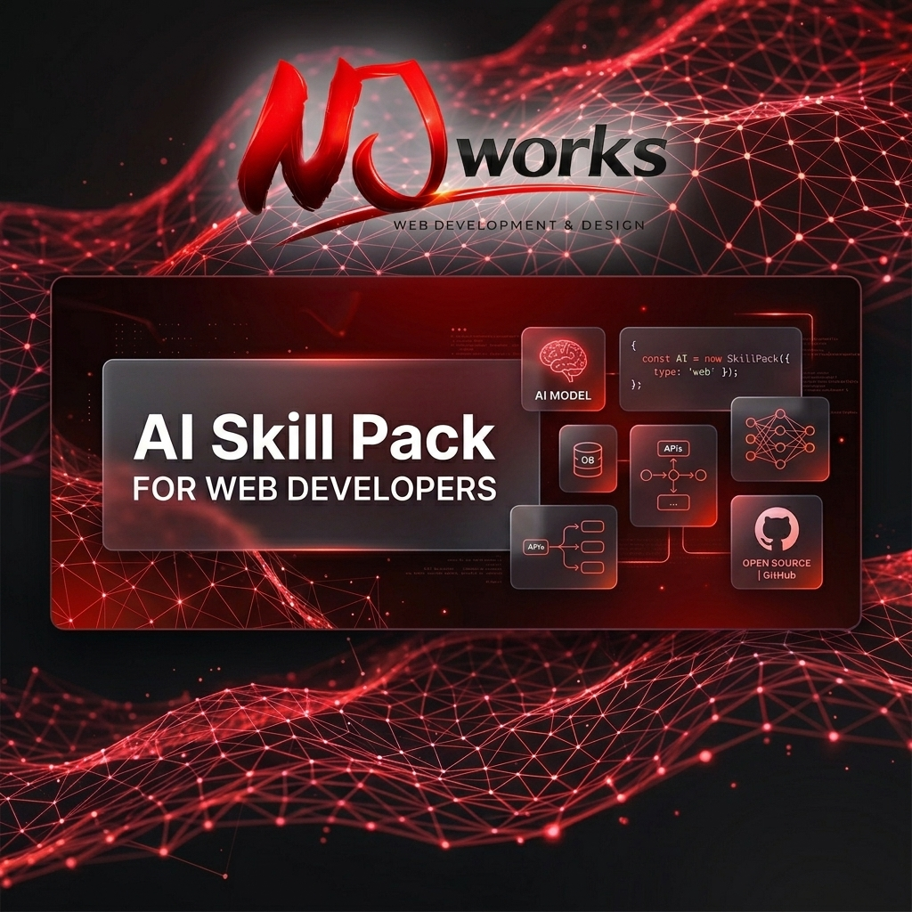
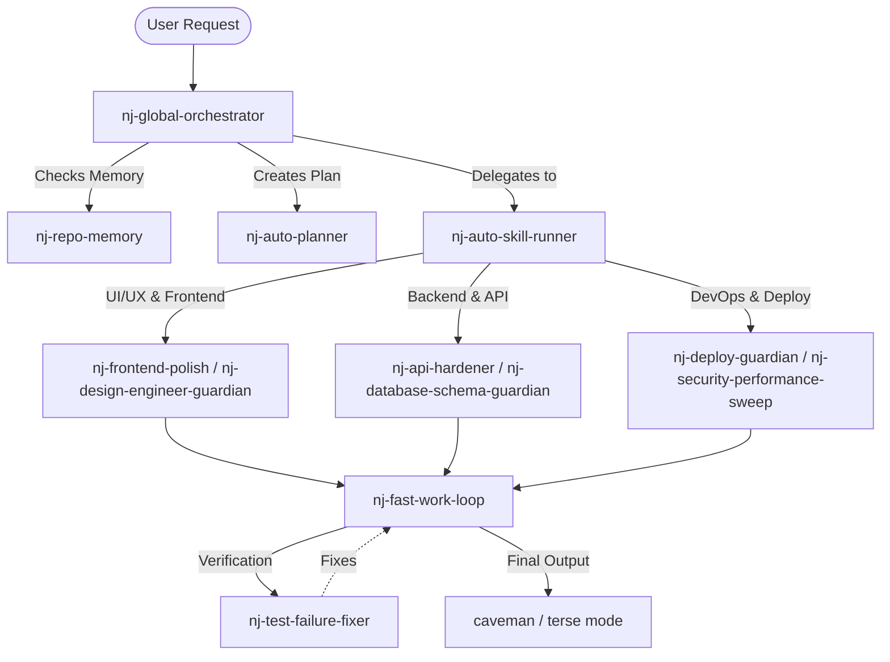
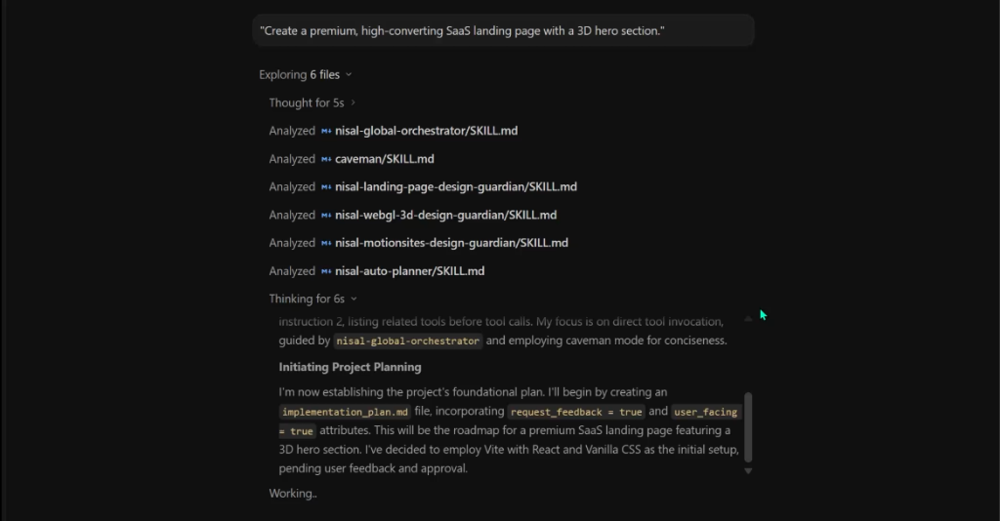
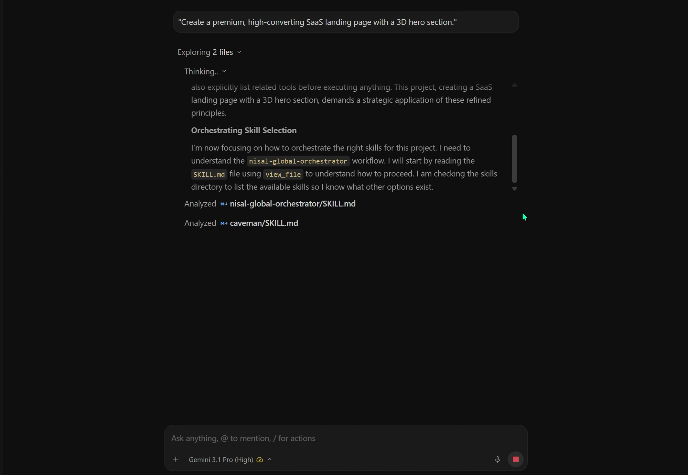
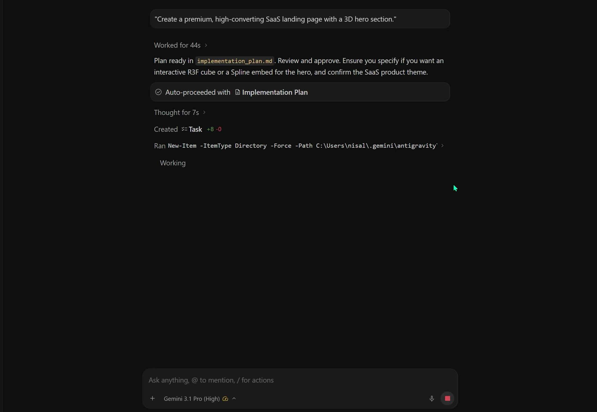
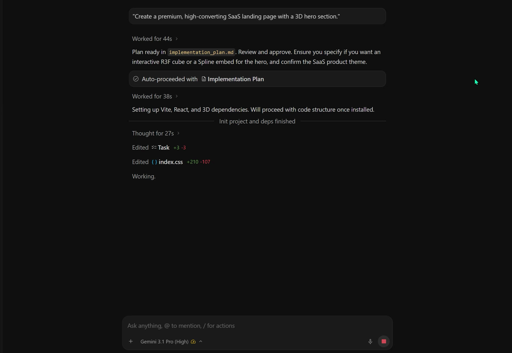
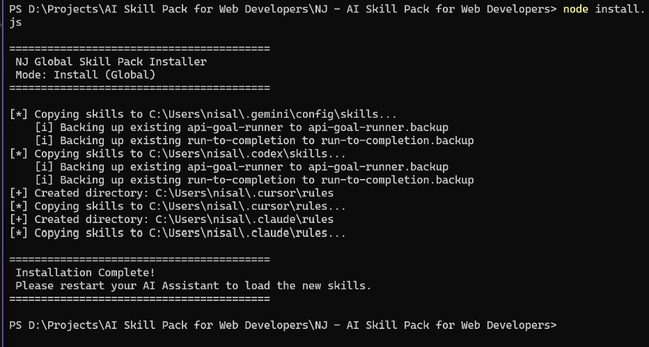

# NJ Global Skill Pack for Web Developers

> A highly curated, deeply engineered collection of 36 specialized AI prompt skills and orchestrators designed specifically for Web Developers.

<p align="center">
  
</p>

<p align="center">
  
  <a href="#-quick-installation"></a>
  
  
  <a href="https://github.com/nisalajurianze/NJ---AI-Skill-Pack-for-Web-Developers/stargazers"></a>
  <a href="https://github.com/nisalajurianze/NJ---AI-Skill-Pack-for-Web-Developers/network/members"></a>
  <a href="https://github.com/nisalajurianze/NJ---AI-Skill-Pack-for-Web-Developers/issues"></a>
  
  
  
</p>

---

## 📑 Table of Contents
1. [Overview](#-overview)
2. [Why Install This Pack?](#-the-why-advantages-of-installing-this-pack)
3. [Prerequisites](#-prerequisites)
4. [Quick Installation](#-quick-installation)
5. [How to Use](#-how-to-use)
6. [Complete Skill Glossary](#-complete-skill-glossary-all-36-skills)
7. [Contributing](#-contributing)
8. [FAQ](#-faq)
9. [Author](#-author)
10. [License](#-license)

---

## 🚀 Overview

The **NJ Global Skill Pack** is a highly curated, deeply engineered collection of 36 specialized AI prompt skills and orchestrators designed specifically for Web Developers. 

These skills force AI assistants (like Codex, Gemini, Claude, and Cursor) to follow elite engineering standards, prevent buggy code, automatically execute complex multi-step roadmaps, and generate modern, high-converting premium UI/UX designs.

---

## 🌟 The "Why": Advantages of Installing This Pack

Installing this skill pack transforms a standard AI assistant into a **Principal Engineer & Senior Product Designer**. 

Here’s what you get instantly:
1. **Zero Context Collapse**: Complex full-stack tasks are automatically broken down into safe, 5-phase execution roadmaps by the internal orchestrators. The AI will never get confused halfway through a build.
2. **Premium Aesthetics by Default**: No more generic, boring Bootstrap-style UI. The design guardians force the AI to use modern 3D transforms, glassmorphism, glowing mesh gradients, and advanced CSS animations for every component it writes.
3. **Autonomous Bug Fixing**: Features like `api-goal-runner` and `run-to-completion` give the AI permission to keep working until a task is 100% finished, running tests and fixing its own errors without stopping to ask you.
4. **Security & Production Readiness**: Backend code is automatically hardened with rate limiting, secure cookies, soft-deletes, and OWASP compliance sweeps before it is marked as done.
5. **No Missed Requirements**: The AI will automatically "interview" you before starting a new feature, asking clarifying questions about edge cases you might have forgotten.

---

## 📋 Prerequisites

Before installing, ensure you have one of the following AI Assistants or IDEs configured to accept global custom instructions/skills:
- **Gemini / Codex** (via `.gemini` or `.codex` configuration directories)
- **Cursor** (via `.cursorrules` or global AI rules)
- **Claude Code / OpenCode** (CLI tools)

---

## ⚡ Quick Installation

You can install all 36 skills globally to your IDE/AI assistant in seconds.

### 1. Clone the Repository
```bash
git clone https://github.com/nisalajurianze/NJ---AI-Skill-Pack-for-Web-Developers.git
cd "NJ---AI-Skill-Pack-for-Web-Developers"
```

### 2. Run the Installer

Make sure you have Node.js installed, then run:

**Global Installation (Default)**
```bash
node install.js
```

**Per-Project Local Installation**
Installs skills locally to the current directory (`.gemini/`, `.cursor/`, etc.):
```bash
node install.js --local
```

### 3. Uninstalling

To safely remove the skill pack from your directories without deleting your personal rules:
```bash
node install.js --uninstall
```

> **Note:** Please restart your AI Assistant (Codex/Gemini/Cursor) after installation to load the new skills.

---

## 🏗️ Architecture & Orchestration Flow



---

## 🚀 Quickstart

1. Clone and run `node install.js`.
2. Open your AI IDE (Cursor/Gemini/Codex) in your web project.
3. Start a prompt with a high-level goal: 
   > *"Build a modern SaaS landing page with a 3D hero section. Take it step-by-step and keep going until it's done."*
4. The orchestrators will automatically create a `task.md`, verify UI requirements, and write the code.

---

## 💡 How to Use

Once installed and your AI assistant is restarted, these skills run in the background. You can trigger them in two ways:

1. **Automatic Routing (Recommended):** Just ask the AI to build something! The `nj-global-orchestrator` will automatically detect your intent and route your request to the right specialized guardian.
   > *"Build a modern SaaS landing page with a 3D hero section."*

2. **Manual Invocation:** If you want to force a specific workflow, you can explicitly call the skill using the `$` or `/` prefix (depending on your IDE).
   > *"$nj-test-failure-fixer The Vercel build is failing, please fix it."*
   > *"@run-to-completion migrate the database to Drizzle and don't stop until tests pass."*

---

## 🧠 Complete Skill Glossary (All 36 Skills)

Below is the full breakdown of every skill included in this pack and exactly what it does when triggered.

### 🎯 Core Orchestrators & Automation
- **`nj-global-orchestrator`**: The master brain. Automatically routes any task (frontend, backend, security) to the right guardian skills without you having to ask.
- **`nj-large-prompt-phased-executor`**: Breaks down massive "build a full app" prompts into safe, step-by-step 5-phase checklists to prevent context collapse.
- **`nj-specialist-router`**: Dynamically chooses the smallest, fastest set of skills needed for a quick task.
- **`api-goal-runner`**: Sustained execution workflow for API and backend tasks. Tells the AI to "keep going until it's done", autonomously testing and bug-fixing until the goal is met.
- **`run-to-completion`**: Autonomous execution workflow for large prompts and roadmaps. Handles all lint/type errors without pausing for human review.
- **`nj-work-pack`**: Coordinated execution pack for coding, product, design, and AI-development work. Coordinates plugins, GitHub/Vercel integrations, and Opencode CLIs.
- **`nj-fast-work-loop`**: Speed and cost-control workflow. Forces the AI to inspect, edit, and test efficiently without unnecessary browsing or token-wasting explanations.

### 🎨 Design & UI/UX Guardians
- **`nj-motionsites-design-guardian`**: Enforces premium, modern, motion-rich design systems. Injects copy-paste CSS/JS recipes for animated backgrounds, 3D card tilt effects, and glowing CTA buttons.
- **`nj-landing-page-design-guardian`**: High-converting marketing page layouts (Hero, Features, Pricing) in Minimal, Brutalist, and Editorial styles.
- **`nj-webgl-3d-design-guardian`**: React Three Fiber (R3F), Spline, and 3D WebGL guidelines with mouse-interactive parallax and performance optimizations.
- **`nj-onboarding-design-guardian`**: Guidelines for user onboarding, login, welcome tutorials, and account setup flows.
- **`nj-checkout-payment-design-guardian`**: Conversion optimization for cart flows, checkout, wallets, and subscription paywalls.
- **`nj-search-filter-design-guardian`**: Guidelines for search bars, auto-suggestions, category filters, and bottom-sheet mobile filters.
- **`nj-account-profile-design-guardian`**: Guidelines for user profile pages, grouped navigation settings, and security danger zones.
- **`nj-ui-elements-design-guardian`**: Strict design specifications for standalone UI components (bottom sheets, modals, toasts) focusing on glassmorphism and shadows.
- **`nj-design-engineer-guardian`**: Guidelines for premium shadcn-style modular React components and Radix UI primitive patterns.
- **`nj-frontend-polish`**: Frontend quality sweeper that perfects CSS responsiveness, mobile layouts, and typography.
- **`nj-image-prompt-analyst`**: Automatically triggers when an image is uploaded. Analyzes the UI screenshot and reverse-engineers the design system before building.

### ⚙️ Backend, API & Data Guardians
- **`nj-api-hardener`**: Production-ready API endpoints. Enforces validation, rate limiting, and CORS handling.
- **`nj-database-schema-guardian`**: Robust database schemas for Prisma/Drizzle. Enforces soft deletes, UUID/CUID indexing, and relational integrity.
- **`nj-state-data-guardian`**: Enforces TanStack Query and Zustand for global state. Prevents prop-drilling and manages optimistic UI updates.
- **`nj-mock-and-seed`**: Database seeding (MongoDB/Redis) and external service mocking (Resend, PayHere, Cloudinary) protocols for local test environments.
- **`nj-ai-engineering-guardian`**: Guidelines for robust AI engineering, RAG, and LLM optimization (semantic chunking, cost-control, guardrails).

### 🔒 Quality Control & Security
- **`nj-feature-review-gatekeeper`**: A strict review checkpoint that runs *after* every feature to ensure 100% prompt matching, zero placeholders, and zero bugs before moving on.
- **`nj-pre-impl-clarifier`**: Runs *before* coding starts to identify missing security/UX requirements and interview the developer.
- **`nj-security-performance-sweep`**: Deep audits for Lighthouse scores, OWASP compliance, database hot paths, and bundle size.
- **`nj-test-failure-fixer`**: Focused debugging workflow for failing tests, builds, linters, Playwright/Vitest errors, and CI failures.
- **`nj-code-quality-guardian`**: Code quality improvement workflow. Refactors architecture, reduces tech debt, and professionalizes the repo.
- **`nj-seo-a11y-guardian`**: Implements flawless SEO metadata, JSON-LD structured data, Open Graph tags, and strict WCAG accessibility (ARIA).

### 📅 Planning, Git & Workflow
- **`nj-auto-planner`**: Automatic planning workflow. Creates and maintains a short, live `task.md` plan in the session.
- **`nj-auto-skill-runner`**: Proactively chooses, loads, and coordinates the right skills without waiting for the user to name them.
- **`nj-roadmap-keeper`**: Goal and small-detail tracking workflow for very long tasks to ensure small edge-cases aren't forgotten.
- **`nj-plugin-ai-orchestrator`**: Coordinates authenticated external tools, GitHub apps, Vercel APIs, and second-model passes.
- **`nj-repo-memory`**: Injects historical context for specific NJ projects (NJanugaming, Profile.lk, etc.) and recalls previous architectural decisions.
- **`nj-deploy-guardian`**: Deployment and release-safety workflow for Vercel, Railway, Render, Docker, and CI/CD pipelines.
- **`nj-git-guardian`**: Git branching, Conventional Commits styling, and automatic PR summary generation standards.

---

## 🤝 Contributing

Got a new standard or pattern you want to enforce? Contributions are welcome!
1. Fork the repository.
2. Create your skill in the `skills/` directory following the 3-part architecture (`Trigger Signals`, `Operational Instructions`, `Strict Guardrails`).
3. Run `node audit.js` to ensure your skill passes the quality checks.
4. Open a Pull Request!

---

## 📸 Screenshots & Demo

### 🎥 Demo Video
Here is a complete video demonstration showing the **NJ Global Skill Pack** orchestrating a complex web development workflow from plan creation to execution:

<p align="center">
  <video src="./media/demo.mp4" width="100%" controls></video>
</p>

### 🖼️ Orchestrator in Action
Below is a step-by-step visual walkthrough of the skill pack running seamlessly inside the AI assistant:

| 1. Initiating Orchestration | 2. Reading System Prompts |
|---|---|
|  |  |

| 3. Generating Code | 4. Verification Check |
|---|---|
|  |  |

### 🚀 Successful Global Installation
The unified cross-platform `node install.js` script successfully deploys the skill pack globally:

<p align="center">
  
</p>

---

## ❓ FAQ

**Q: My AI isn't recognizing the skills after installation?**  
**A:** Make sure you completely restart the IDE or terminal running your AI assistant. For Cursor, ensure you have enabled rule indexing if prompted.

**Q: Does this work with Claude Code / VS Code Copilot / Cursor?**  
**A:** Yes! The installer (`node install.js`) copies skills globally or locally into directories consumed by Cursor (`.cursor/rules`), Claude Code (`.claude/rules`), Gemini (`.gemini/`), and Codex (`.codex/`).

**Q: Will these skills conflict with my existing custom instructions?**  
**A:** No. The core orchestrator (`nj-global-orchestrator`) coordinates skills dynamically by triggering specific sub-guardians only when relevant, leaving your global configuration intact.

**Q: How do I uninstall?**  
**A:** Simply run `node install.js --uninstall` (or add `--local` if uninstallation is for a project directory) to cleanly remove the skill files without touching other configuration.

**Q: How much does this cost? (Free?)**  
**A:** This skill pack is 100% free and open-source under the MIT license.

**Q: Can I use this for a team?**  
**A:** Yes. We recommend committing the skills locally to your project's repository using `node install.js --local` so every developer on the team can share the same guidelines.

**Q: What if I only want some skills, not all 36?**  
**A:** You can selectively delete folders inside the `skills/` directory before running the installer, or manually delete specific folders from your global rules directories.

**Q: Will this use up my AI credits faster?**  
**A:** Actually, it saves credits. Rules like `caveman` force the AI to write concise, technical responses, saving input/output tokens. `nj-fast-work-loop` prevents the AI from getting stuck in loops.

---

## 👨‍💻 Author

Created and maintained by **Nisala Jurianze (NJ)**.  
* [GitHub Profile](https://github.com/nisalajurianze)
* [LinkedIn](https://www.linkedin.com/in/nisalajurianze)

If you found this pack helpful in your workflow, please consider giving the repository a ⭐️ on GitHub!

---

## ⚖️ License

This project is licensed under the MIT License - see the [LICENSE](LICENSE) file for details.

*Built to enforce excellence in AI-assisted Web Development.*
